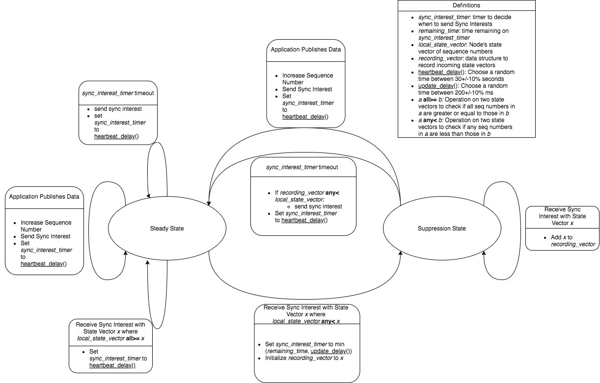

# State Vector Sync Protocol Specification

This page describes the protocol specification of [State Vector Sync (SVS)](/README.md) Version 3.

_Last update to specification: 2025-01-04_

## 1. Basic Protocol Design

```
Node A       Node B      Node C
seq=10       seq=15      seq=24
   |            |           |          \
   |            |           |           \
                                        |
  <-------------------------->          |
     Periodic Sync Interest             | Steady
[/node-a/:10,/node-b/:15,/node-c/:24]   | State
                                        |
   |            |           |           |
   |            |           |           /
   |            |           |          /

Node A publishes Data                  \
seq=11                                  \
                                        |
  <-------------------------->          | Data Set State
           Sync Interest                | Reconciliation
[/node-a/:11,/node-b/:15,/node-c/:24]   |
                                        /
   |                        |          /
   |                        |          \
   |                        |           \
   |      Data Interest     |           |
   | <----------<---------- |           | Publication
   |       Publication      |           | Retrieval
   | ---------------------> |           |
   |                        |           /
   |                        |          /
```

## 2. Format and Naming

**State Vector Data Name**: `/<group-prefix>/v=3`

The State Vector is encoded in the content of a signed NDN Data packet.

**Sync Interest Name**: `/<group-prefix>/v=3/<parameters-digest>`

The State Vector Data is included in the `ApplicationParameters` of the Sync Interest.
The Interest Lifetime for the Sync Interest is 1 second.

**Data Interest name**: `/<node-prefix>/<group-prefix>/t=<bootstrap-time>/seq=<seq>`

_Note:_ Choosing alternative Data Interest formats may be decided on application-level.

## 3. State Vector Specification

```abnf
StateVector = STATE-VECTOR-TYPE TLV-LENGTH
              *StateVectorEntry

StateVectorEntry = STATE-VECTOR-ENTRY-TYPE TLV-LENGTH
                   Name
                   *SeqNoEntry

SeqNoEntry = SEQ-NO-ENTRY-TYPE TLV-LENGTH
             BootstrapTime
             SeqNo

BootstrapTime = BOOTSTRAP-TIME-TYPE TLV-LENGTH NonNegativeInteger
SeqNo = SEQ-NO-TYPE TLV-LENGTH NonNegativeInteger

STATE-VECTOR-TYPE = 201
STATE-VECTOR-ENTRY-TYPE = 202

SEQ-NO-ENTRY-TYPE = 210
BOOTSTRAP-TIME-TYPE = 212
SEQ-NO-TYPE = 214
```

- The encoded state vector in the Interest consists of a sequence of State Vector Entries, ordered
  in [NDN canonical order](https://docs.named-data.net/NDN-packet-spec/0.3/name.html#canonical-order) of name.
- Each entry has a node name followed by a list of [bootstrap timetamp, sequence number] tuples.
- Bootstrap time is specified as seconds since the Unix epoch. Negative values are invalid.
- The sequence number is 1-indexed, i.e. the first valid sequence number in a state vector is 1.
- If an entry is not present in the state vector, it is considered as 0 for any calculations.

### Bootstrap Time

When a node joins the Sync Group, it initializes its local state with an empty state vector
and sets the local bootstrap time. When the sequence number is incremented, the node adds an entry
to the state vector with the initial boostrap time and the new sequence number.

The node SHOULD attempt to locally preserve the bootstrap time for as long as possible,
and reuse it when rejoining the Sync group. If the node loses the bootstrap time, it MUST
use the current timestamp as the new bootstrap time.

If any received `BootstrapTime` is more than 86400s in the future compared to current time,
the entire state vector SHOULD be ignored.

### Comparing State Vectors

A State Vector `A` is outdated to `B`, if any of the following conditions are met:

- `A` is missing a name present in `B`.
- `A` contains an entry with any seq number strictly smaller than `B`.

### Merging State Vectors

The merge of two state vectors `A` and `B` is a new state vector `M` such that:

- `M` contains all names present in `A` or `B`.
- For each entry in `A` and `B`, `M` contains all `SeqNoEntry` in `A` and `B`.
- For each `SeqNoEntry` in `C`, the `SeqNo` is the maximum of the `SeqNo` in `A` and `B`.

## 4. State Sync

### 4.1 Sync Interest Timer

SVS utilizes a single Sync Interest timer.
It can take on one of the two timeout values that are used by the protocol.
The values used by the timer are as follows.

- `PeriodicTimeout`: defaults to 30 seconds (±10% uniform)
- `SuppressionPeriod`: defaults to 200ms
- `SuppressionTimeout`: random value between 0 to `SuppressionPeriod`. \
  An exponential decay function SHOULD be used for the timeout value.
  ```
  c = SuppressionPeriod  // constant factor
  v = random(0, c)       // uniform random value
  f = 10.0               // decay factor
  SuppressionTimeout = c * (1 - e^((v - c) / (c / f)))
  ```

### 4.2 Send Sync Interests on new publication

- When the node generates a new publication, immediately emit a
  Sync Interest, and reset the Sync Interest Timer to `PeriodicTimeout`.

### 4.3 Sync Ack Policy - Do not acknowledge Sync Interests

- Reason: sending Sync Acks from multiple nodes result in unsolicited data.\
  (only the first one is delivered, others are dropped)

### 4.5 Sync Interest Processing and Timer Expiry

Nodes can either be in _Steady State_, or in _Suppression State_

- _Steady State_: The Sync group is synchronized.
  Incoming Sync Interests carry the latest known state.
- _Suppression State_: Incoming Sync Interests indicate a state inconsistency.
  The node tries to reconcile the inconsistency by emitting a up-to-date Sync Interest.
  Use a suppression timer before sending to prevent flooding.

**Steady State**

- When entering _Steady State_, reset the Sync Interest timer to `PeriodicTimeout`

- Incoming Sync Interest is up-to-date or newer.
  1. If the incoming state vector is newer, update the local state vector. \
     Store the current timestamp as the last update time for each updated node.
  1. Reset Sync Interest timer to `PeriodicTimeout`.

- Incoming Sync Interest is outdated.
  1. If every node with an outdated sequence number in the incoming state vector
    was updated in the last `SuppressionPeriod`, drop the Sync Interest.
  1. Otherwise, move to _Suppression State_

- On expiration of timer:
  1. Emit a Sync Interest with the current local state vector.
  1. Reset Sync Interest timer to `PeriodicTimeout`.

**Suppression State**

- When entering Suppression State_, reset the Sync Interest timer to `SuppressionTimeout`

- For every incoming Sync Interest:
  1. Update the local state vector with any newer sequence numbers.
  1. Merge the state vector into a `MergedStateVector`.

- On expiration of timer:
  1. If `MergedStateVector` is up-to-date; no inconsistency.
  1. If `MergedStateVector` is outdated; inconsistent state.\
     Emit up-to-date Sync Interest.
  1. Move to _Steady State_.

## 5. Examples

In the following examples, if the timestamp is not explicitly mentioned, it is assumed to be some arbitrary time.

### 5.1 State Sync - Example without packet loss

Sync Group with 3 participants, node `A`, `B`, and `C`.

- Data set state: `[A=10, B=15, C=25]`, all nodes are in Sync
- Node `A` publishes new publication and increments seq number.
- `A` sends Sync Interests with `[A=11, B=15, C=25]`.
- `B` and `C` receive Sync Interest and update their local states accordingly.
- _Consistent state is re-established_

### 5.2 State Sync - Example with packet loss

Sync Group with 3 participants, node `A`, `B`, and `C`.

- Data set state: `[A=10, B=15, C=25]`, all nodes are in Sync
- Node `A` publishes new publication and increments seq number.
- `A` sends Sync Interests with `[A=11, B=15, C=25]`
- `B` receives Sync Interest, but Interest does not reach `C`
- **Inconsistent state - `C`'s state is outdated.**
- `C` sends periodic Heartbeat Interest with `[*A=10*, B=15, C=25]`
  - `A` and `B` receive `C`'s outdated Sync Interest.
  - `A` and `B` set suppression timer.
  - `A`'s timer expires and sends up-to-date Sync Interest.
- `B` receives `A`'s Sync Interest during suppression interval. `B` resets timer to periodic timeout.
- `C` also receives `A`'s Sync Interest and updates the state accordingly.
- _Consistent state is re-established_

### 5.3 State Sync - Re-Boostrap

Sync Group with 3 participants, node `A`, `B`, and `C`.

State below is represented as `[Name=[BootstrapTime, SeqNo]...]`

- State: `[A=[1636266330,10], B=[1636266412,15], C=[1636266115,25]]`, all nodes are in Sync
- Node `A` now goes offline and loses all local state information.
- Node `B` publishes new publication and increments seq number.
- State: `[A=[1636266330,10], B=[1636266412,16], C=[1636266115,25]]`. **`A` is offline**.
- Node `A` comes back online and re-joins the Sync Group, using a new bootstrap time.
- Node `A` publishes new publication and increments seq number.
- `A` sends its state vector: `[A=[1736266473,1]]`.
- `B` and `C` receive `A`'s Sync Interest and update their local state. `B` and `C` enter suppression state.
- `B`'s timer expires and sends up-to-date Sync Interest.\
  State: `[A=[1636266330,10][1736266473,1], B=[1636266412,16], C=[1636266115,25]]`
- `A` and `C` receive `B`'s Sync Interest. `A` updates local state. `C` resets timer to periodic timeout.
- _Consistent state is re-established_

## 6. SVS State Machine



## License


State Vector Sync is an open source project licensed under a [Creative Commons Attribution-ShareAlike 4.0 International License](https://creativecommons.org/licenses/by-sa/4.0/). See [LICENSE](/LICENSE) for more information.

Different licenses for the implementations might apply.
